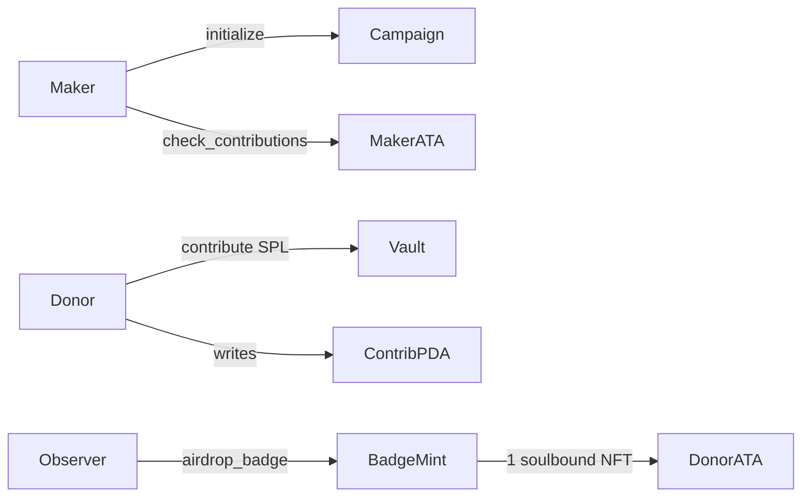

# Token Fundraiser + soulbound contributor badges

Anchor 1.1.2 example: a maker opens an SPL-token campaign, wallets donate (hard 10% cap per wallet), the maker claims if the target is hit, and each donor later receives a **soulbound Token-2022 NFT** (funding credential). An off-chain observer pins Metaplex JSON and cranks the mint.

This started from the classic “vault + contributor PDA + refund” school program. Claim used to **close** the fundraiser. That is gone: the campaign must stay on-chain until every badge is minted.

---

## Prerequisites

| Tool | Version |
| --- | --- |
| Anchor | 1.1.2 (`avm install 1.1.2 && avm use 1.1.2`) |
| Solana CLI | 3.1 or newer |
| Node | 20+, with `yarn` |

```bash
yarn install
anchor build
anchor keys sync   # first time only — see below
anchor test
```

The repo declares a program id it may not ship the keypair for. First `anchor build` can generate a different one and tests fail with `DeclaredProgramIdMismatch`. `anchor keys sync` rewrites `declare_id!` and `Anchor.toml` to match. Run it once, then rebuild.

---

## How it works (simple)

1. **Maker** calls `initialize` with a raise mint, a target (raw units, must be **> 3 whole tokens**), a duration in **days**, and a **minter** pubkey. The program creates a PDA campaign and an SPL vault ATA owned by that PDA.
2. **Donors** call `contribute`. Each wallet has a contributor PDA. First gift gets a **position** (`1, 2, …`). Later gifts from the same wallet append a `{timestamp, amount}` to `collaborations` (max 16). Per wallet, total given cannot exceed **10% of the target** — so hitting a 30-token goal needs **at least 10 wallets**.
3. If the vault reaches the target **before** the window ends, the maker calls `check_contributions`. Tokens move to the maker. The campaign is marked `is_claimed` and **stays open** (we still need it as mint authority for badges).
4. An **observer** (Node script) sees `CampaignClaimed`, loads each contributor, optionally pins JSON to Pinata, and calls `airdrop_badge` as the stored `minter`. That creates a Token-2022 mint with **NonTransferable** (cannot send the NFT) + **MetadataPointer** + on-chain name/symbol/uri, then mints **1** token to the donor’s Token-2022 ATA.
5. When `badges_minted == contributor_count` and the vault is empty, the maker calls `close_fundraiser` and gets the rent back.
6. If the window ends **short** of the target, donors `refund`. No NFTs on that path.

On-chain metadata is only `name`, `symbol`, `uri`. Image, attributes (contributor, beneficiary, amount, position) and the collaborations array live in **JSON at `uri`** (IPFS / Pinata). That JSON can grow without another program upgrade.

---

## Architecture



### Accounts / PDAs

| Account | Seeds | Holds |
| --- | --- | --- |
| Fundraiser | `["fundraiser", maker]` | target, vault mint, minter, flags, counts |
| Vault | ATA(`mint_to_raise`, fundraiser) | donated SPL |
| Contributor | `["contributor", fundraiser, donor]` | amount, position, collaborations, `badge_minted` |
| Badge mint | `["badge", fundraiser, donor]` | Token-2022 mint (NFT) |
| Badge ATA | ATA(badge mint, donor, Token-2022) | supply `1` |

One campaign per maker (PDA is only seeded by maker).

### Instructions

| Ix | Who | What |
| --- | --- | --- |
| `initialize(amount, duration)` | maker | Create campaign + vault. `minter` is a remaining account, stored on the campaign. |
| `contribute(amount)` | donor | SPL transfer into vault; history + `ContributionRecorded`. |
| `check_contributions` | maker | If vault ≥ target, pay maker, set `is_claimed`, emit `CampaignClaimed`. Does **not** close. |
| `airdrop_badge(uri)` | **minter** only | After claim: Token-2022 soulbound NFT for one donor. |
| `close_fundraiser` | maker | After claim **and** all badges; close vault then campaign. |
| `refund` | donor | After deadline, target missed; close contributor PDA. |

### Events (for the observer)

- `ContributionRecorded` — index donors (hint; observer also `getProgramAccounts`s contributor PDAs).
- `CampaignClaimed` — start the airdrop crank.
- `BadgeAirdropped` — mint + uri for logs.

`onLogs` is **not** a queue. Restart the observer and the in-memory index is empty. On claim we also load contributors from chain (`memcmp` at offset 8 = `fundraiser` pubkey).

### On-chain vs off-chain metadata

```
Token-2022 mint  →  name / symbol / uri  (TLV, soulbound)
uri              →  Metaplex JSON: image, attributes, properties.collaborations
```

Pinata JWT is only needed to **pin that JSON**. The PNG can already live at `BADGE_IMAGE_URI`. No JWT → observer still mints, with a fixture `https://example.com/badge.json`.

### Why an observer

One Solana tx cannot mint N NFTs for N donors (CU + account limits). The program mints **one** badge per `airdrop_badge`. A crank (this repo: `scripts/badge-observer.ts`) is the intended caller. `minter` is fixed at `initialize` so the crank key can mint **without** holding the maker key.

---

## What changed from the original school program (and why)

| Original | Now | Why |
| --- | --- | --- |
| `check_contributions` had `close = maker` | Campaign stays. New `close_fundraiser` after badges | Closing on claim destroyed the PDA we need as mint authority / lookup. |
| Contributor was just `amount: u64` | `position`, `collaborations[]`, `badge_minted`, links to fundraiser + wallet | Credential needs “who, when, how much, nth donor”. |
| No NFT | `airdrop_badge` Token-2022 **NonTransferable** | Soulbound = extension, not freeze (freeze can be thawed). |
| Anyone could theoretically crank | `payer == fundraiser.minter` | Observer key is authorized at init. |
| `1_u8.pow(decimals)` / `MIN.pow(decimals)` | `10u64.pow(decimals)` | Old “min 1 token” was `1^n == 1` raw unit. Target min was `3^decimals`, not 3 tokens. |
| Duration check on contribute was inverted in the README | Window: `(now - start) / 86400 < duration` | Original snippet in this file allowed contribute *after* the deadline. |
| Anchor CPI took `AccountInfo` | Anchor 1.0+ `CpiContext` takes the **program id** | Version bump. |
| Claim was the end | Claim → badges → close | NFT airdrop is a second phase. |

State additions on `Fundraiser`: `minter`, `contributor_count`, `badges_minted`, `is_claimed`.

---

## Repo map

```
programs/fundraiser/src/
  lib.rs                 six instructions
  state/                 Fundraiser, Contributor, Collaboration
  instructions/          initialize, contribute, checker, airdrop_badge, close_fundraiser, refund
  events.rs
scripts/
  badge-observer.ts      websocket crank + optional Pinata
  e2e-observer.ts        10 wallets hit a 30-token target, then claim
  load-config.ts         .env
  build-badge-json.ts    Metaplex JSON
  pinata.ts              Pinata v3 upload
tests/
  fundraiser.ts          happy-ish path + “cannot mint before claim”
  time-window.ts         live clock
  time-window-bankrun.ts warp clock → refund
  badge-json.ts          JSON + config, no validator
```

---

## Tests (`anchor test`)

Mocha globs `tests/**/*.ts`. `anchor test` spins a **private** validator, runs mocha, **kills it**. That is **not** the observer.

```bash
anchor test
```

JSON helpers only:

```bash
yarn run ts-mocha -p ./tsconfig.json -t 10000 tests/badge-json.ts
```

`fundraiser.ts` cannot finish a real airdrop with one wallet: 10% cap vs a 30-token target. It asserts `CampaignNotClaimed` if you mint too early. Full mint is the local e2e below.

---

## Local scripts (observer + badges)

Need a validator that **stays up**. `anchor test` will fight you for `:8899`.

**Terminal A — validator**

```bash
solana-test-validator          # first time
# or, after a failed upgrade / dirty ledger:
solana-test-validator --reset
```

**Terminal B — deploy**

```bash
anchor deploy
```

If upgrade dies with `ExtendProgram was superseded by ExtendProgramChecked`, reset the validator and deploy fresh. Localnet is disposable.

**Env**

```bash
cp .env.example .env
```

| Var | Role |
| --- | --- |
| `SOLANA_RPC_URL` / `SOLANA_WS_URL` | default local `8899` / `8900` |
| `BADGE_IMAGE_URI` | PNG CID / gateway URL you already pinned |
| `PINATA_JWT` | optional. Empty → fixture uri. Set → Pinata **v3** (`org:files:write`). Legacy `/pinning/pinJSONToIPFS` keys will 403 `NO_SCOPES_FOUND`. |
| `AIRDROP_PAYER_KEYPAIR` | must be the **same pubkey** passed as `minter` in `initialize` (e2e uses `AnchorProvider` wallet = `~/.config/solana/id.json`) |
| `BADGE_URI_SCHEME` | `ipfs` → `ipfs://<cid>` or `gateway` |

Node does **not** load `.env` by itself; `load-config.ts` uses `dotenv`. `~` in paths is not expanded by Yarn — scripts use `$HOME` / `expandHome`.

**Terminal C — observer** (start **before** the e2e, or pass a fundraiser pubkey to crank after claim)

```bash
yarn observe
# or crank a campaign that already claimed:
yarn observe -- <fundraiser-pubkey>
```

**Terminal D — 10 donors + claim**

```bash
yarn e2e-test
```

That script: create mint (6 decimals), `initialize(30_000_000, 7)` with `minter =` your id.json, 10 keypairs × `3_000_000`, then `check_contributions`. Observer should log `minting nft` / off-chain JSON / `nft minted` (on-chain name/symbol/uri, ATA amount `1`).

If the observer was down during contribute, crank still works: contributors are loaded from chain.

---

## Constraints that bite

- **10% cap** → one wallet cannot complete the demo campaign. Use `yarn e2e-test`.
- **Token-2022 mint size**: create the mint account as `Mint + NonTransferable + MetadataPointer` only. Metadata TLV is realloc’d **after** `InitializeMint2`. Pre-sizing for JSON uri makes `InitializeMint2` return `InvalidAccountData`.
- **Pinata**: current keys are v3 (`uploads.pinata.cloud/v3/files`). Need Files **write**, not a gateway-only JWT.
- **`onLogs`**: not historical. Backfill is `contributor.all({ memcmp offset 8 })`.

---

## Layout reminder (raise amounts)

Raise mint in tests/e2e is **6 decimals**. `30_000_000` = 30 tokens. Max per wallet = 3 tokens = `3_000_000`. Minimum campaign size is **> 3 whole tokens** of that mint.
